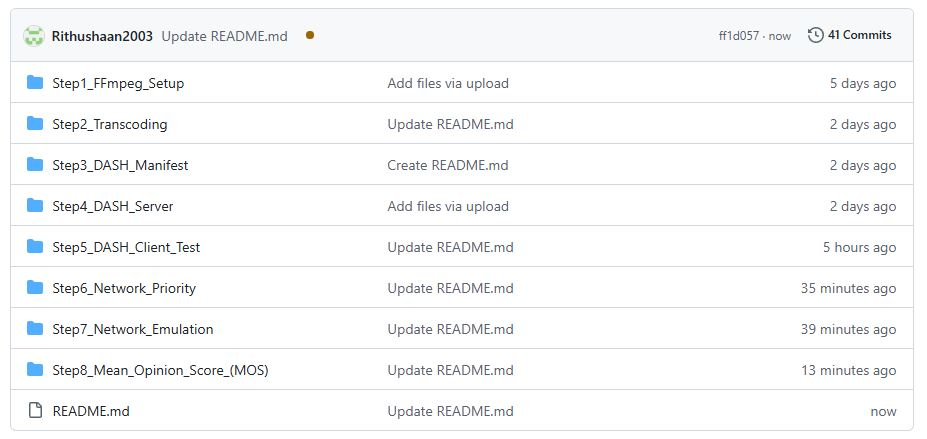
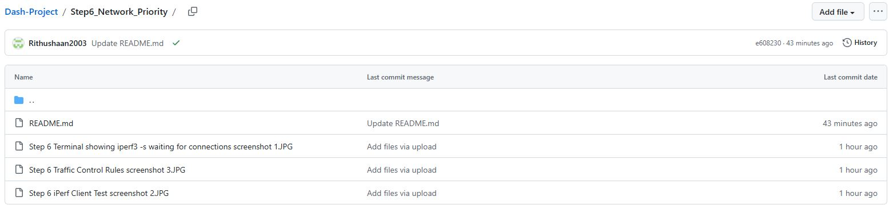
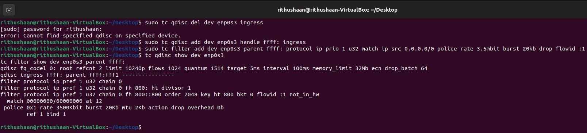

# Networking Coursework – Full Project (Steps 1–8)
This repository contains the complete implementation of Steps 1–8 for the Networking Coursework project.

The project covers video encoding, DASH streaming, network traffic shaping, and subjective video‑quality evaluation using MOS (ITU‑T BT.500).

Each step includes documentation, commands, screenshots, and results.

---

## 📁 Project Structure

Step1_FFmpeg_Setup/            – FFmpeg installation and initial configuration

Step2_Transcoding/             – Video transcoding into multiple bitrates

Step3_DASH_Manifest/           – MPD manifest generation for DASH

Step4_DASH_Server/             – DASH streaming server setup

Step5_DASH_Client_Test/        – DASH and Bitmovin client playback tests

Step6_Network_Priority/        – iPerf traffic prioritisation using tc + HTB

Step7_Network_Emulation/       – TBF, HTB and policing network emulation

Step8_Mean_Opinion_Score_(MOS)/   – MOS evaluation following ITU‑T BT.500

## Each folder contains:

• 	A detailed README.md

• 	Required screenshots

• 	Commands used

• 	Observations and results

---

## 🛠 Installation & Deployment Instructions

To reproduce the project:

1. Clone the repository

git clone https://github.com/Rithushaan2003/Dash-Project.git

2. Prepare the VMs

• 	Import the Client VM and Prometheus VM

• 	Ensure both are on the same internal network

• 	Update packages:

sudo apt update

3. Install required tools

• sudo apt install ffmpeg iperf3 tc curl apache2

4. Follow each step in order

• Start from Step1 and continue through Step8.

Each step’s README explains:

• 	What to run

• 	Expected output

• 	Screenshots

• 	Results and analysis

---

## 📸 Screenshots

### 1. Repository Structure

### 2. Example Step Folder (Step 6)

### 3. Terminal Output Example

---

## ✔️ Completion

All steps (1–8) have been completed and documented.

This repository contains the full project required for submission, including:

• 	Video encoding

• 	DASH streaming

• 	Network shaping

• 	Traffic prioritisation

• 	MOS evaluation

• 	Full GitHub documentation

